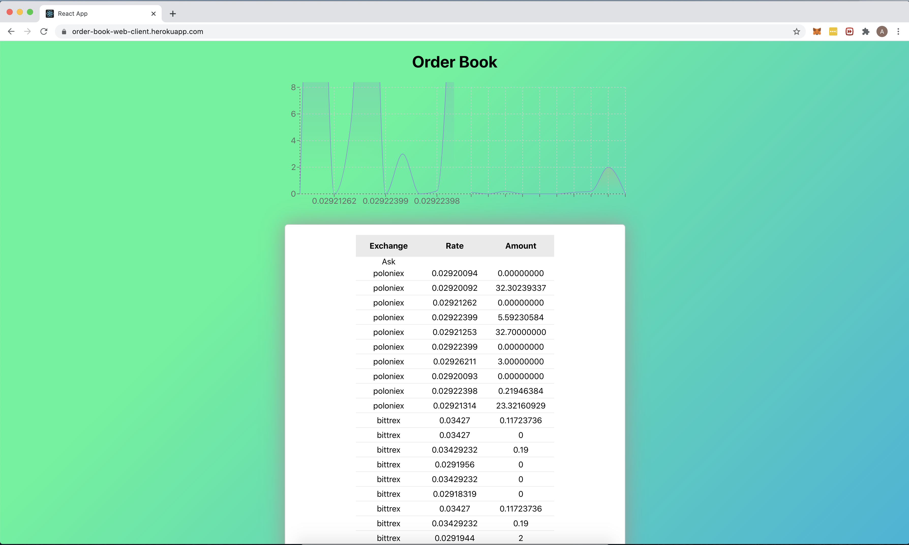
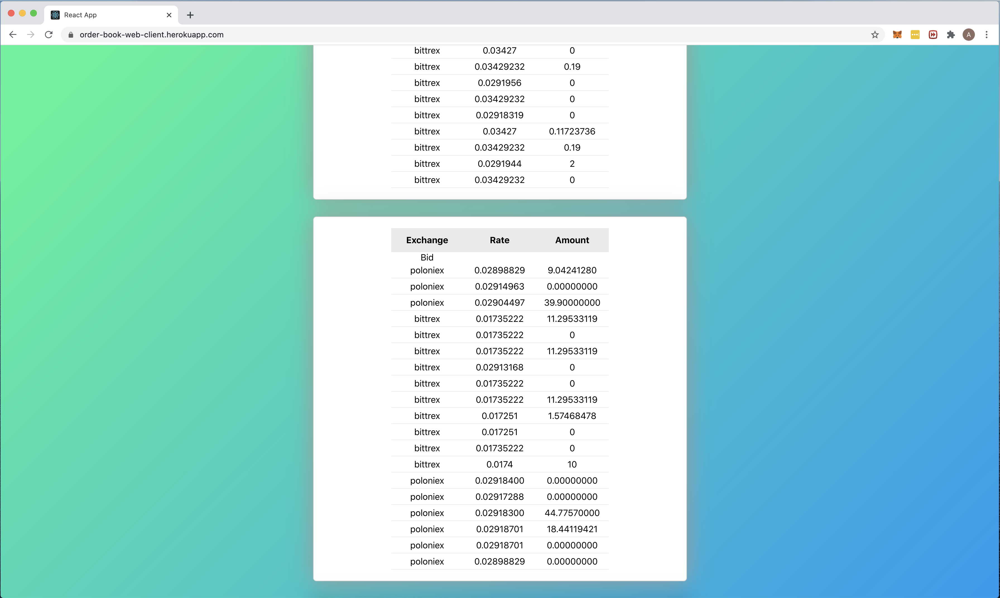

# BTC-ETH Order Book
Front end application for a combined orderbook from Bittrex and Poloniex,
The app communicates with a node backend using websockets to get real time data 



## The App is Deployed :rocket: [here](https://order-book-web-client.herokuapp.com)

## Start the App

###install deps

    ```
    npm i && npm start
    ```
